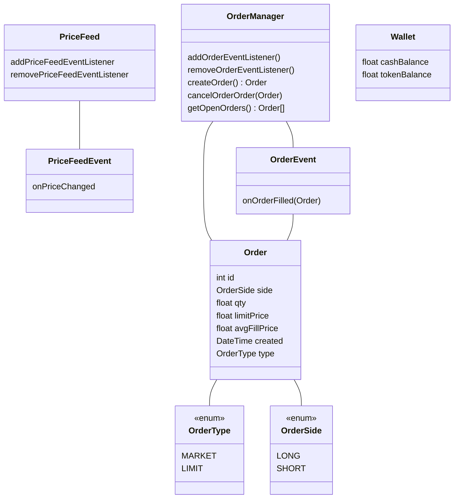

# trading_bot

```mermaid
classDiagram

class PriceFeed
PriceFeed: addPriceFeedEventListener
PriceFeed: removePriceFeedEventListener

class PriceFeedEvent
PriceFeedEvent: onPriceChanged

PriceFeed -- PriceFeedEvent

class OrderManager
OrderManager: addOrderEventListener()
OrderManager: removeOrderEventListener()
OrderManager: createOrder() Order
OrderManager: cancelOrderOrder(Order)
OrderManager: getOpenOrders() Order[]

class OrderEvent
OrderEvent: onOrderFilled(Order)

class Order
Order: int id
Order: OrderSide side
Order: float qty
Order: float limitPrice
Order: float avgFillPrice
Order: DateTime created
Order: OrderType type

class OrderSide
<<enum>> OrderSide
OrderSide: LONG
OrderSide: SHORT

class OrderType
<<enum>> OrderType
OrderType: MARKET
OrderType: LIMIT

OrderManager -- OrderEvent
OrderManager -- Order
OrderEvent -- Order
Order -- OrderType
Order -- OrderSide

class Wallet
Wallet: float cashBalance
Wallet: float tokenBalance

```
